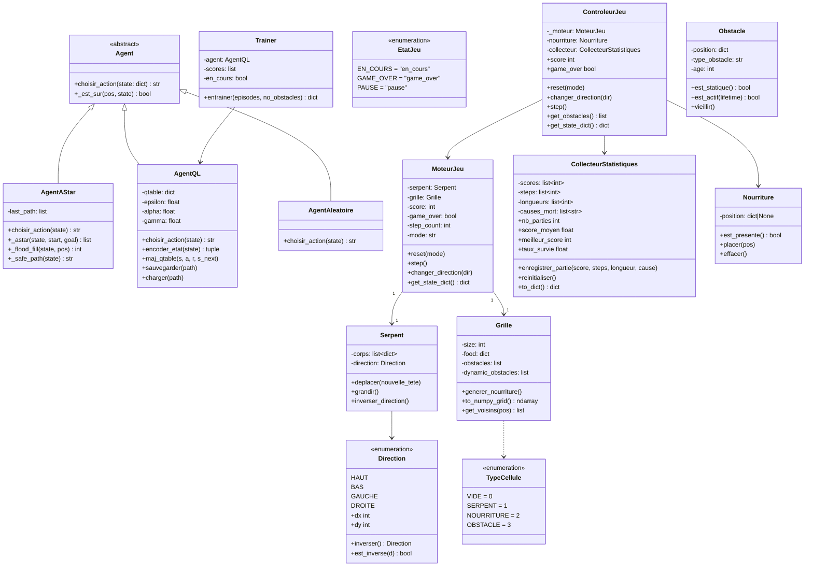
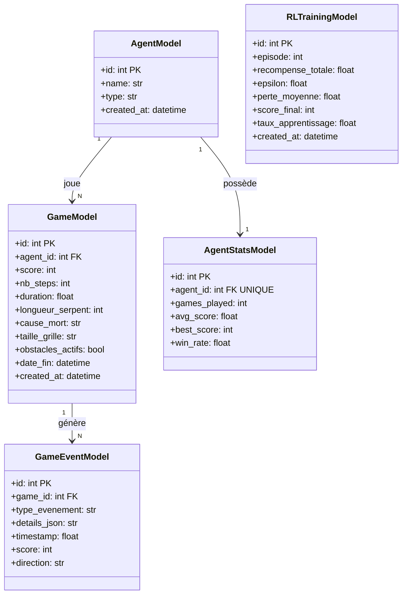
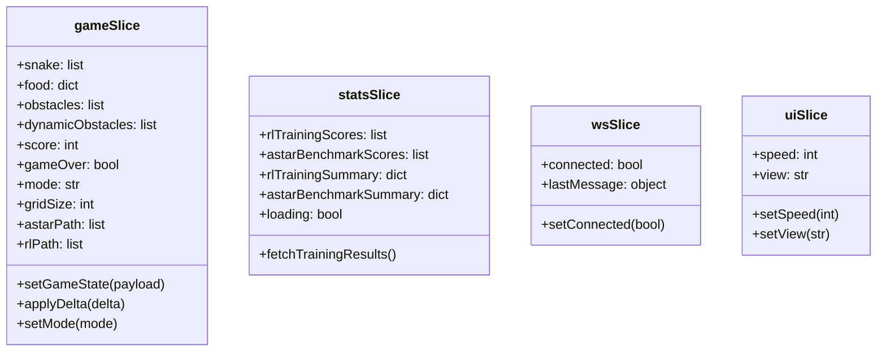

# Rapport de Conception Détaillée Final — Snake AI
## SAE4 — Licence Informatique 3e année — UPJV
### Année universitaire 2024/2025

---

## Table des matières

1. [Architecture logicielle](#1-architecture-logicielle)
2. [Modélisation UML](#2-modélisation-uml)
   - 2.1 Diagramme de classes
   - 2.2 Diagramme de paquetages
   - 2.3 Diagrammes de séquence
3. [Schéma de base de données](#3-schéma-de-base-de-données)
4. [API REST — Endpoints réels](#4-api-rest--endpoints-réels)
5. [Protocole WebSocket](#5-protocole-websocket)
6. [Justification des choix techniques](#6-justification-des-choix-techniques)
7. [Algorithmes implémentés](#7-algorithmes-implémentés)
8. [Plan de tests](#8-plan-de-tests)

---

## 1. Architecture logicielle

### Vue d'ensemble

L'application suit une architecture client-serveur en deux couches distinctes communiquant via WebSocket (temps réel) et REST (opérations ponctuelles).

```
┌──────────────────────────────────────────┐        ┌──────────────────────────────────────────┐
│           FRONTEND (React 18)            │        │           BACKEND (FastAPI + Python)      │
│                                          │        │                                          │
│  App.jsx                                 │        │  main.py                                 │
│   ├─ WelcomeScreen                       │        │   ├─ routes/game_routes.py               │
│   ├─ GameGrid.jsx (bi-canvas)            │ REST   │   ├─ routes/agents_routes.py             │
│   ├─ ControlPanel.jsx                    │◄──────►│   ├─ routes/stats_routes.py              │
│   ├─ BattleArena.jsx                     │ HTTP   │   ├─ routes/training_routes.py           │
│   ├─ StatsComparison.jsx                 │        │   └─ websocket_handler.py                │
│   └─ TrainingPanel.jsx                   │        │                                          │
│                                          │ WS     │  game_engine/                            │
│  Redux Store (4 slices)                  │◄──────►│   ├─ moteur.py                           │
│   ├─ gameSlice                           │        │   ├─ serpent.py                          │
│   ├─ statsSlice                          │        │   ├─ grille.py                           │
│   ├─ wsSlice                             │        │   ├─ direction.py                        │
│   └─ uiSlice                             │        │   ├─ nourriture.py                       │
│                                          │        │   ├─ obstacle.py                         │
│  services/                               │        │   ├─ collecteur_statistiques.py          │
│   ├─ api.js (axios REST)                 │        │   └─ controleur_jeu.py                   │
│   └─ websocket.js (WS natif)             │        │                                          │
└──────────────────────────────────────────┘        │  agents/                                 │
                                                    │   ├─ agent_astar.py                      │
                                                    │   ├─ agent_rl.py                         │
                                                    │   └─ base_agent.py                       │
                                                    │                                          │
                                                    │  SQLite (snake.db)                       │
                                                    │   ├─ agents                              │
                                                    │   ├─ games                               │
                                                    │   ├─ game_events                         │
                                                    │   ├─ agent_stats                         │
                                                    │   └─ rl_training                         │
                                                    └──────────────────────────────────────────┘
```

### Rendu Canvas bi-couche (GameGrid)

La grille de jeu utilise **deux canvas superposés** pour optimiser les performances :

```
┌─────────────────────────────┐
│  Canvas 1 — Fond (bgCanvas) │  Redessiné seulement si : gridSize, obstacles, mode, cellSize changent
│  • Fond dégradé             │
│  • Grille (lignes)          │
│  • Obstacles statiques      │
└─────────────────────────────┘
       ↑ position: absolute, z-index bas
┌─────────────────────────────┐
│  Canvas 2 — Entités         │  Redessiné à chaque tick (snake, food, path, FPS)
│  (entityCanvas)             │
│  • Overlay chemin A*/RL     │
│  • Obstacles dynamiques     │
│  • Nourriture               │
│  • Serpent                  │
│  • Compteur FPS             │
└─────────────────────────────┘
       ↑ position: absolute, z-index haut
```

**cellSize** calculé dynamiquement :
```
cellSize = Math.max(10, Math.floor(Math.min(availableWidth, availableHeight) / gridSize))
```

La taille disponible est mesurée via `ResizeObserver` sur le conteneur `GameGrid`.

---

## 2. Modélisation UML

### 2.1 Diagramme de classes

#### Backend — Moteur de jeu



#### Modèles ORM (SQLAlchemy)



#### Frontend — Redux + Composants



---

### 2.2 Diagramme de paquetages

```
backend/
├── agents/          # Agents IA (A*, RL, Aléatoire)
├── game_engine/     # Moteur de jeu (Serpent, Grille, Direction, Façade)
├── models/          # ORM SQLAlchemy (5 tables)
├── routes/          # Routeurs FastAPI (game, agents, stats, training)
├── training/        # Boucle d'entraînement RL
├── config.py        # Paramètres globaux centralisés
├── database.py      # Engine SQLite + SessionLocal
├── main.py          # Point d'entrée, CORS, montage routes, /ws
└── websocket_handler.py  # Boucle de jeu WebSocket

frontend/src/
├── components/      # Composants React (GameGrid, ControlPanel, BattleArena…)
├── hooks/           # useWebSocket, useKeyboard
├── services/        # api.js (axios), websocket.js
├── store/           # Redux slices (game, stats, ws, ui)
└── tests/           # Tests Vitest
```

---

### 2.3 Diagrammes de séquence

#### Séquence 1 — Partie en mode A* (WebSocket)

```
Utilisateur  Frontend(React)    useWebSocket    Backend(FastAPI)   AgentAStar   SQLite
     |              |                |                 |               |           |
     |──clic Start──►|               |                 |               |           |
     |              |──send("start")─►|                |               |           |
     |              |                |──WS message────►|               |           |
     |              |                |                 |──game_loop()  |           |
     |              |                |                 |──choisir_     |           |
     |              |                |                 |  action()────►|           |
     |              |                |                 |◄─direction────|           |
     |              |                |                 |──step()       |           |
     |              |                |◄──game_delta───-|               |           |
     |              |◄──WS message───|                 |               |           |
     |              |──applyDelta()  |                 |               |           |
     |◄─re-render───|                |     ...boucle tick...           |           |
     |              |                |                 |──game_over    |           |
     |              |                |                 |──save_game()──────────────►|
     |              |                |◄──game_over────-|               |           |
     |◄─Game Over───|                |                 |               |           |
```

**Protocole delta :**
- Premier frame : `game_state` complet (serpent, nourriture, obstacles, score, mode...)
- Frames suivantes : `game_delta` (seulement les champs dynamiques : snake, food, score, game_over, astar_path/rl_path)

#### Séquence 2 — Battle Arena (REST step-by-step)

```
Frontend(BattleArena)          Backend(FastAPI)        AgentAStar / AgentQL
        |                             |                         |
        |──POST /api/agent/init──────►|                         |
        |◄──game_state────────────────|                         |
        |                             |                         |
        |──[boucle setInterval]       |                         |
        |──POST /api/agent/step───────►|                        |
        |   {agent_type: "astar",     |──choisir_action()──────►|
        |    game_state: {...}}        |◄─direction──────────────|
        |                             |──moteur.step()          |
        |◄──{payload: state,          |                         |
        |    meta: {inference_ms}}────|                         |
        |                             |                         |
        |──POST /api/agent/step───────►|                        |
        |   {agent_type: "rl", ...}   |──choisir_action()──────►|
        |◄──{payload, meta}───────────|◄─direction──────────────|
        |──[fin si game_over]         |                         |
        |──POST /api/agent/save──────►|                         |
        |◄──{ok}──────────────────────|                         |
```

#### Séquence 3 — Entraînement Q-Learning

```
Frontend(TrainingPanel)        Backend(training_routes)    Trainer       SQLite
        |                              |                      |              |
        |──POST /api/training/run──────►|                     |              |
        |   {episodes: 80,             |──Trainer.entrainer()►|              |
        |    no_obstacles: false}       |                      |──boucle 80ep.|
        |                              |                      |──AgentQL.step|
        |                              |                      |──maj_qtable()|
        |                              |                      |──sauvegarder(|
        |                              |                      |  qtable.json)|
        |                              |                      |──INSERT rl_  |
        |                              |                      |  training────►|
        |◄──{scores, summary}──────────|◄─résultats───────────|              |
        |──Redux dispatch              |                      |              |
        |──afficher graphiques         |                      |              |
```

---

## 3. Schéma de base de données

Voir [schema_base_de_donnees.md](schema_base_de_donnees.md) pour le schéma complet.

```
agents (1) ────────── (N) games
agents (1) ────────── (1) agent_stats   [UNIQUE sur agent_id]
games  (1) ────────── (N) game_events
rl_training                              [table indépendante]
```

**Initialisation automatique :**

Au premier démarrage, `database.py` crée les tables et insère 3 agents par défaut :

| id | name | type |
|---|---|---|
| 1 | Agent Humain | human |
| 2 | Agent A* | astar |
| 3 | Agent Q-Learning | rl |

---

## 4. API REST — Endpoints réels

### Routeur `/api/game`

| Méthode | Endpoint | Description |
|---|---|---|
| GET | `/api/game/state` | État courant du jeu |
| POST | `/api/game/reset` | Réinitialise le jeu |
| POST | `/api/game/start` | Démarre la boucle |
| POST | `/api/game/pause` | Met en pause |
| POST | `/api/game/direction` | Envoie une direction (mode manuel) |

### Routeur `/api/agent`

| Méthode | Endpoint | Description | Body |
|---|---|---|---|
| POST | `/api/agent/init` | Initialise une grille pour Battle Arena | `{agent_type, mode}` |
| POST | `/api/agent/step` | Un pas d'agent (Battle Arena) | `{agent_type, game_state}` |
| POST | `/api/agent/save` | Sauvegarde la partie en BDD | `{agent_type, score, nb_steps, duration}` |

### Routeur `/api/stats`

| Méthode | Endpoint | Description |
|---|---|---|
| GET | `/api/stats/comparison` | Stats agrégées A* vs RL |
| GET | `/api/stats/history` | Historique des 200 dernières parties |
| GET | `/api/stats/replay/{game_id}` | Événements d'une partie pour le replay |

### Routeur `/api/training`

| Méthode | Endpoint | Description | Body |
|---|---|---|---|
| POST | `/api/training/run` | Lance un entraînement RL ou benchmark A* | `{agent_type, episodes, no_obstacles}` |
| GET | `/api/training/results` | Résultats du dernier entraînement | — |

### Endpoint santé

| Méthode | Endpoint | Description |
|---|---|---|
| GET | `/api/health` | Vérifie que le backend répond |

### WebSocket

| Endpoint | Description |
|---|---|
| `WS /ws` | Boucle de jeu temps réel |

---

## 5. Protocole WebSocket

### Messages client → serveur

```json
{"type": "set_mode", "mode": "astar"}
{"type": "start"}
{"type": "set_paused", "paused": true}
{"type": "reset"}
{"type": "set_speed", "interval": 100}
{"type": "direction", "direction": "HAUT"}
```

### Messages serveur → client

**Premier frame (état complet) :**
```json
{
  "type": "game_state",
  "snake": [{"x": 12, "y": 12}, ...],
  "food": {"x": 5, "y": 8},
  "obstacles": [{"x": 3, "y": 3}, ...],
  "dynamic_obstacles": [],
  "score": 0,
  "game_over": false,
  "mode": "astar",
  "grid_size": 25,
  "astar_path": [{"x": 11, "y": 12}, ...]
}
```

**Frames suivantes (delta) :**
```json
{
  "type": "game_delta",
  "snake": [{"x": 11, "y": 12}, ...],
  "food": {"x": 5, "y": 8},
  "score": 1,
  "game_over": false,
  "astar_path": [...]
}
```

**Optimisation binaire :** Les messages sont sérialisés avec `orjson` (3-5× plus rapide que `json` standard) et envoyés en bytes via `websocket.send_bytes()`.

**Reconnexion automatique :** `WSService` (frontend) implémente un backoff exponentiel (100ms → 200ms → 400ms... jusqu'à 10s) pour se reconnecter en cas de déconnexion.

---

## 6. Justification des choix techniques

### Pourquoi WebSocket natif FastAPI plutôt que Socket.IO ?

| Critère | WebSocket natif (choix) | Socket.IO |
|---|---|---|
| Dépendance | Intégré dans Starlette/FastAPI | Bibliothèque externe (~80 Ko bundle) |
| Overhead message | Aucun | ~10-30 % (enveloppe protocol) |
| Reconnexion | Implémentée manuellement (backoff) | Intégrée |
| Sérialisation | orjson (bytes, 3-5× plus rapide) | JSON texte |

**Décision :** Pour ~5-20 frames/seconde de données de jeu, le surcoût Socket.IO est injustifié. Le WebSocket natif avec orjson offre des performances supérieures.

### Pourquoi Canvas HTML5 et non DOM/SVG ?

- Une grille 25×25 redessinée ~10×/s = 6 250 opérations/s sur le DOM → dégradation visible
- Canvas : tout le rendu est délégué au GPU via le contexte 2D
- Bi-couche : le fond (grille + obstacles statiques) n'est redessiné que lors d'un changement de taille ou de mode → ~90 % des frames ne redessinentque la couche entités

### Pourquoi Redux Toolkit ?

- 4 slices indépendants (game, stats, ws, ui) permettent d'éviter les renders inutiles
- `setGameState` (premier frame) vs `applyDelta` (frames suivantes) : minimise les mutations Redux

### Pourquoi SQLite + SQLAlchemy ?

- Projet local mono-utilisateur : aucun serveur de base de données requis
- Fichier unique `snake.db` facilement portable
- Passage à PostgreSQL possible avec un simple changement de `DATABASE_URL` dans `config.py`

---

## 7. Algorithmes implémentés

### 7.1 A* (agent_astar.py)

```
Entrée : état du jeu (tête serpent, corps, obstacles, nourriture)
Sortie : direction (str)

1. Construire open_set = [(f=h(tête,food), compteur=0, pos=tête, chemin=[])]
2. Tant que open_set non vide :
   a. Extraire (f, _, pos, chemin) avec coût minimal (heapq)
   b. Si pos == nourriture → retourner première direction du chemin
   c. Pour chaque voisin de pos (HAUT, BAS, GAUCHE, DROITE) :
      - Si voisin non bloqué (pas corps, pas obstacle) :
        g_new = len(chemin) + 1
        h_new = |voisin.x - food.x| + |voisin.y - food.y|
        heapq.heappush(open_set, (g_new + h_new, compteur++, voisin, chemin + [dir]))
3. Si aucun chemin → stratégie de survie

Stratégie de survie :
1. Calculer A* vers la queue du serpent (tail-chasing)
2. Si A* queue réussit → suivre ce chemin
3. Sinon → choisir la direction avec le plus grand flood fill
   (BFS depuis chaque case voisine non bloquée, choisir max espace libre)

Flood fill (BFS) :
1. Initialiser queue = [pos], visited = {pos}
2. Pour chaque case de la queue : ajouter les voisins non bloqués
3. Retourner len(visited)
```

**Complexité :** O(N log N) où N = nombre de cases (25×25 = 625)

### 7.2 Q-Learning (agent_rl.py)

```
Encodage état — 11 features binaires (NumPy uint8) :

Données relatives à la direction actuelle :
  [0] Danger immédiat devant
  [1] Danger immédiat à gauche (relatif)
  [2] Danger immédiat à droite (relatif)

Direction courante (one-hot) :
  [3] Direction == HAUT
  [4] Direction == BAS
  [5] Direction == GAUCHE
  [6] Direction == DROITE

Position relative de la nourriture :
  [7] Nourriture au-dessus
  [8] Nourriture en-dessous
  [9] Nourriture à gauche
  [10] Nourriture à droite

Politique epsilon-greedy :
  avec proba ε  → direction aléatoire (exploration)
  avec proba 1-ε → argmax_a Q(état, a) (exploitation)
  ε : 1.0 → 0.01 par décroissance * 0.995 à chaque épisode

Mise à jour Bellman :
  Q(s,a) ← Q(s,a) + α × [r + γ × max_a' Q(s',a') − Q(s,a)]
  α = 0.1 (learning rate)
  γ = 0.95 (discount factor)

Récompenses :
  +10 : nourriture mangée
  −10 : mort (mur, corps, obstacle)
   +1 : rapprochement de la nourriture (distance Manhattan diminuée)
   −1 : éloignement de la nourriture
```

**Complexité par décision :** O(1) — lookup dictionnaire Python

### 7.3 Comparaison des algorithmes

| Critère | A* | Q-Learning |
|---|---|---|
| Type | Pathfinding déterministe | Apprentissage par renforcement |
| Connaissance grille | Complète (omniscient) | Partielle (11 features locales) |
| Apprentissage | Non | Oui (Q-table, 80 épisodes) |
| Score moyen (80 ep.) | **31.79** | 9.10 |
| Meilleur score | **42** | 23 |
| Taux de survie | **98.75 %** | 88.75 % |
| Temps décision | ~2 ms | < 1 ms |
| Mémoire Q-table | N/A | 18.7 Ko (254 états visités) |

---

## 8. Plan de tests

### Tests backend (pytest) — 107 tests

| Fichier | Couverture | Tests |
|---|---|---|
| `test_serpent.py` | Déplacement, croissance, collisions, demi-tour | ~10 |
| `test_grille.py` | Nourriture, obstacles, voisins, to_numpy_grid | ~10 |
| `test_moteur.py` | Cycle de jeu, step, reset, cause_mort | ~10 |
| `test_astar.py` | Chemin simple, obstacles, fallback survie | ~10 |
| `test_rl.py` | Encodage état, Bellman, epsilon, sauvegarde Q-table | ~15 |
| `test_classes_diagramme.py` | Nourriture, Obstacle, CollecteurStats, ControleurJeu, TypeCellule, EtatJeu, AgentAleatoire | 39 |
| `test_functional.py` | Sessions complètes A*, RL, humain (E2E sans DB) | ~5 |
| `test_integration.py` | Persistance SQLite, latences A* < 50 ms, RL < 5 ms | ~5 |
| `test_api.py` | Routes REST /health, /game, /stats, /agents | ~5 |
| `test_websocket.py` | Connexion WS, messages orjson bytes, game_delta | ~5 |

### Tests frontend (Vitest)

| Fichier | Couverture |
|---|---|
| `gameSlice.test.js` | Réducteurs Redux setGameState, applyDelta, setMode |
| `uiSlice.test.js` | Réducteurs Redux vitesse, vue |
| `Dashboard.test.jsx` | Rendu composant avec différents états |
| `BattleArena.test.jsx` | Rendu, boutons Start/Pause/Reset, scores initiaux |
| `TrainingPanel.test.jsx` | Rendu, Redux preloaded state, toggle obstacles |

### CI/CD (GitHub Actions)

```yaml
jobs:
  test-backend:  # ubuntu-latest, Python 3.11, pytest tests/ -v
  test-frontend: # ubuntu-latest, Node 18, npm test
```

Pipeline déclenché sur : push vers `main` ou `dev`, PR vers `main`.
